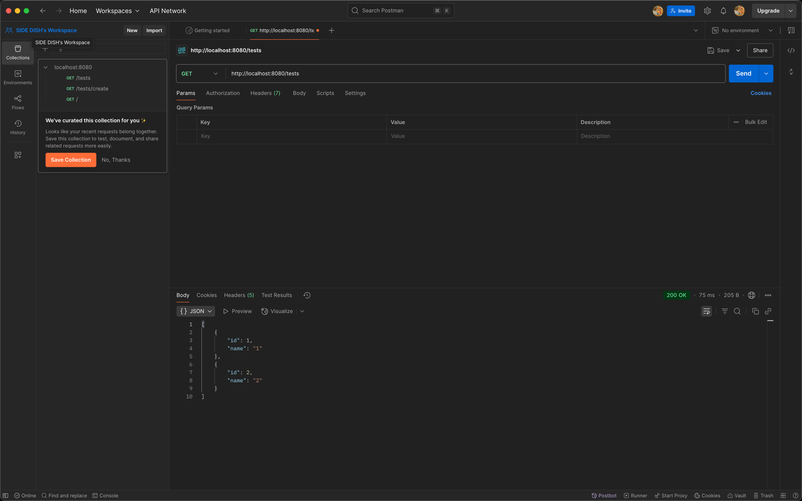

아래는 🌱 **1주차 스프링 미션 일지**를 깔끔하게 정리할 수 있는 마크다운 템플릿입니다. 각 항목마다 설명을 채워넣을 수 있는 공간과 코드 블록 예시까지 포함되어 있습니다.

---

# 🌱 1주차 Spring 미션 일지

---

## ✅ 미션 완료 스크린샷



> Spring Boot 튜토리얼 완료! 스프링 입문을 위한 기반을 다졌습니다 😊

---

## 1️⃣ Spring Boot 튜토리얼 완료

- 진행한 튜토리얼 이름: `spring-tutorial`
- 학습 내용 요약:
  - Spring Boot 프로젝트 생성
  - Controller, Service, Repository 디렉토리 구조 설정
  - 간단한 API 서버 개발
- 느낀 점:
  > "JPA 스바라시! 개쩐다 JPA"

---

## 2️⃣ Spring이 지원하는 핵심 기술 조사

### 🧩 IoC / DI (제어의 역전 / 의존성 주입)

- 설명:
  > 개발자가 객체를 생성하고 관리하는 것이 아니라 Spring이 대신 관리함으로써 느슨한 결합을 가능하게 함

- 예제:
  ```java
  @Service
  public class MyService {
      private final MyRepository myRepository;

      @Autowired
      public MyService(MyRepository myRepository) {
          this.myRepository = myRepository;
      }
  }
  ```

---

### 🧼 AOP (관점 지향 프로그래밍)

- 설명:
    ```markdown
    CC(Core Concern)와 CCC(Cross Cutting Concern)의 분리 
  -------------------------------------------------------------
    로깅, 트랜잭션, 보안처럼 공통된 기능을 비즈니스 로직과 분리하여 코드 중복을 줄임
    ```
- 예제:
  ```java
  @Aspect
  @slf4j
  @Component
  public class LoggingAspect {
      @Before("execution(* com.example.service.*.*(..))")
      public void logBefore(JoinPoint joinPoint) {
          log.debug("메서드 실행 전: " + joinPoint.getSignature());
      }
  }
  ```

---

### 🌉 PSA (Portable Service Abstraction)

- 설명:
  > 스프링이 다양한 기술(JDBC, 트랜잭션, 메시징 등)을 추상화하여 일관된 방식으로 사용할 수 있게 해줌

---

## 3️⃣ Spring Bean과 생명주기

### 🌱 Spring Bean이란?

- Spring 컨테이너에 의해 관리되는 객체를 의미
- ComponentScan()에 의해서 탐색되어 등록되는 경우가 있음
- `@Configuration` `@Component`, `@Service`, `@Repository`, `@Controller`로 등록 가능

### 🔄 Bean 생명주기 요약

1. Bean 생성
2. 의존성 주입
3. 초기화 (`InitializingBean` / `@PostConstruct`)
4. 사용
5. 소멸 (`DisposableBean` / `@PreDestroy`)

```java
@Component
public class MyBean implements InitializingBean, DisposableBean {
    @Override
    public void afterPropertiesSet() {
        System.out.println("초기화 로직 실행");
    }

    @Override
    public void destroy() {
        System.out.println("소멸 로직 실행");
    }
}
```

---

## 4️⃣ 스프링 어노테이션 심층 분석

### 🏷 어노테이션이란?

- 메타데이터를 제공하는 Java 문법
- Java에서는 `@interface`를 사용하여 정의

```java
@Target(ElementType.TYPE)
@Retention(RetentionPolicy.RUNTIME)
public @interface MyAnnotation {
    String value();
}
```

---

### 🔍 컴포넌트 스캔과 빈 등록 과정

- `@ComponentScan`은 `@SpringBootApplication` 클래스 패키지 이하의 클래스에서 `@Component` 계열 어노테이션을 찾아 Bean으로 등록
- Spring Boot는 기본적으로 `@SpringBootApplication`에 포함됨

```java
@SpringBootApplication
@ComponentScan(basePackages = "com.example")
public class Application {
    public static void main(String[] args) {
        SpringApplication.run(Application.class, args);
    }
}
```

---

### 🛠 커스텀 어노테이션 만들기

```java
@Target(ElementType.TYPE)
@Retention(RetentionPolicy.RUNTIME)
@Component
public @interface MyService {
    String value() default "";
}
```

---

## 5️⃣ 단위 테스트 vs 통합 테스트

| 구분        | 단위 테스트                                | 통합 테스트                                 |
|-------------|---------------------------------------------|---------------------------------------------|
| 목적        | 개별 단위(클래스, 메서드) 검증              | 여러 컴포넌트 간 상호작용 검증              |
| 도구        | JUnit, Mockito                              | SpringBootTest, TestRestTemplate 등         |
| 실행 속도   | 빠름                                        | 상대적으로 느림                             |
| 의존성      | 최소화, Mock 사용                           | 실제 Bean 사용, DB 연결 등 포함             |

### 단위 테스트 예시
```java
@ExtendWith(MockitoExtension.class)
class UserServiceTest {
    @Mock
    UserRepository userRepository;

    @InjectMocks
    UserService userService;

    @Test
    void findUserTest() {
        // given, when, then
    }
}
```

### 통합 테스트 예시
```java
@SpringBootTest
@AutoConfigureMockMvc
class UserIntegrationTest {

    @Autowired
    private MockMvc mockMvc;

    @Test
    void getUserApiTest() throws Exception {
        mockMvc.perform(get("/api/user/1"))
               .andExpect(status().isOk());
    }
}
```
